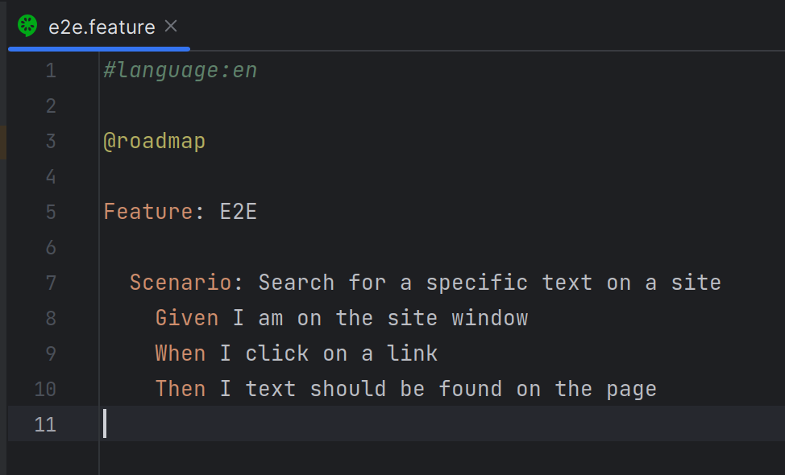
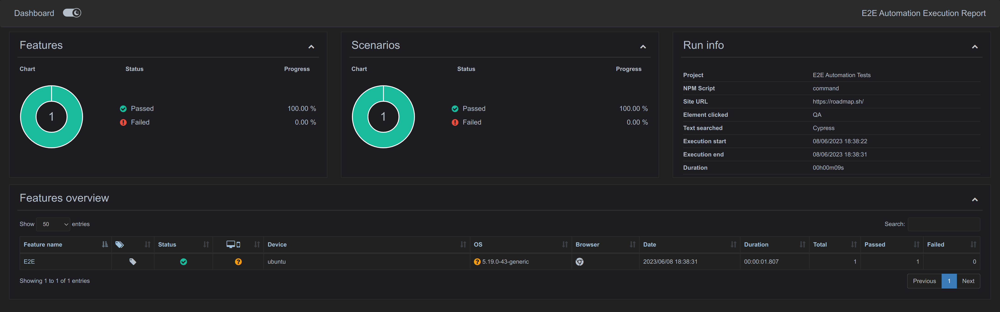
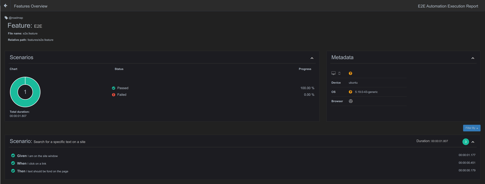

# ROADMAP E2E AUTOMATED TESTS

## TABLE OF CONTENTS

[OVERVIEW](#overview)

[PRE REQUISITES](#prerequisites)

[USE CASES](#use-cases)

[HELP MENU](#help-menu)

[REPORT](#report)

## OVERVIEW

The objective of this README.md document file is to provide help on how to install, update and run the automated tests on a Cypress E2E Front End Automated Test project.

It supports BDD based scenarios features files, and generates a pretty dashboard report at the end of each test cycle.








## PREREQUISITES

1. NPM: ^8.11.0;
2. Node (TS-Node): ^16.16.0.

In the project folder, open a terminal and run the following command:

```
npm install
```

This step install and update all project dependencies.

The following steps are required to configure the eslint and prettier libraries.

### Web Storm or IntelliJ

There is no need to install any plugin, except some configuration are required:

#### STEP 1

1. Press <i>CTRL+ALT+S</i> to open Settings dialog:


#### STEP 2

1. Search for `ESLint`, go to <b>Languages & Frameworks</b> section and then select <b>ESLint</b>;


2. Select the <b>Manual ESLint configuration</b> radiobox and then select in the <b>ESLint package:</b> combobox the path inside the <i>node_modules</i> folder;


3. Select the <b>Run eslint --fix on save</b> checkbox:


4. Click in the <b>All actions on save...</b> link:


5. Select both <b>Run eslint --fix</b> and <b>Run Prettier</b> checkboxes:


6. In the <b>Run Prettier</b> checkbox section, click in the <b>Configure...</b> link:


7. Similar to the ESLint plugin process from the menu, click in the <b>Manual Prettier configuration</b> checkbox and then select <b>Prettier package:</b> the path inside the <b>node_modules</b> folder;


8. Click in the <b>Run on save</b> checkbox and then click in both <b>Apply</b> and <b>OK</b> buttons:


9. Search for `Node.js`, go to <b>Languages & Frameworks</b> section and then select <b>Coding assistance for Node.js</b>;


### VSCODE

Need to install two plugins:

1. [Prettier Code Formatter](https://marketplace.visualstudio.com/items?itemName=dbaeumer.vscode-eslint);
2. [Eslint Plugin](https://marketplace.visualstudio.com/items?itemName=dbaeumer.vscode-eslint).

Note: In VSCODE, both Eslint and Prettier configuration is done automatically.

## USE CASES

```
ts-node e2e_cli.ts
ts-node e2e_cli.ts --script command
ts-node e2e_cli.ts --script cy
ts-node e2e_cli.ts --script command -s roadmap -c qa -t cypress
```

## HELP MENU

```
> ts-node e2e_cli.ts --help

Usage: ts-node e2e_cli.ts [--script command] [-s roadmap.sh] [-t cypress]

Options:
      --help     Show help                                             [boolean]
      --version  Show version number                                   [boolean]
      --script   NPM script to be executed. E.G.: command|cy
                                                   [string] [default: "command"]
  -s, --site     A site to be opened. E.G.: roadmap.sh
                                       [string] [default: "https://roadmap.sh/"]
  -e, --element  An element to br clicked. E.G.: QA     [string] [default: "QA"]
  -t, --text     A text to be searched on page. E.G.: cypress
                                                   [string] [default: "Cypress"]
      --output   Console output type.
                                    [choices: "full", "plain"] [default: "full"]
```

## REPORT

After running the <i>command</i> script, a folder named ´.tmp/report´ will dynamically be created in the project folder, which contains a `index.hmtl` report file, as follows:


A video of the execution test will be created in the `cypress/videos` folder.

In case a step from a scenario fails, a screenshot will be created in the `cypress/screenshots` folder and also be attached to report:  


Note that the only possible configuration a switch between Light/Dark themes modes.